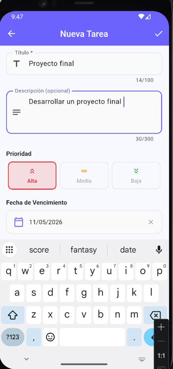
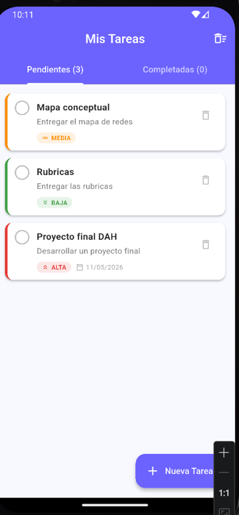

# 📋 Control de Tareas

Aplicación móvil multiplataforma desarrollada con **Flutter** y almacenamiento local **SQLite**, orientada a facilitar la gestión y organización de actividades diarias.

Desarrollada como proyecto de la materia **Desarrollo de Aplicaciones Híbridas (GDB-2404)** — Instituto Tecnológico Superior de Huetamo.

---

## 📱 Descarga

[](https://github.com/Marjoriemd/todo-app-flutter.git/releases/download/v1.0.0/app-release.apk)

> Requiere Android 5.0 (API 21) o superior.

---

## ✨ Funcionalidades

- ✅ Crear, editar y eliminar tareas
- 🎯 Clasificar tareas por prioridad (Alta, Media, Baja)
- 📅 Establecer fecha de vencimiento
- ☑️ Marcar tareas como completadas
- 📂 Pestañas separadas: Pendientes / Completadas
- 💾 Almacenamiento local sin necesidad de internet
- 🗑️ Limpiar todas las tareas completadas

---

## 🛠️ Tecnologías utilizadas

| Tecnología | Versión | Uso |
|---|---|---|
| Flutter | 3.44.0 | Framework principal |
| Dart | 3.x | Lenguaje de programación |
| SQLite (sqflite) | 2.4.2 | Almacenamiento local |
| path | 1.9.0 | Rutas del sistema de archivos |
| intl | 0.19.0 | Formato de fechas |
| uuid | 4.3.3 | Generación de IDs únicos |

---

## 🏗️ Arquitectura del proyecto

```
lib/
├── main.dart                  # Punto de entrada
├── models/
│   └── task.dart              # Modelo de datos Task
├── services/
│   └── database_service.dart  # CRUD con SQLite (Singleton)
├── screens/
│   ├── home_screen.dart       # Pantalla principal
│   └── task_form_screen.dart  # Formulario crear/editar
├── widgets/
│   └── task_card.dart         # Tarjeta reutilizable
└── theme/
    └── app_theme.dart         # Tema visual centralizado
```

---

## 🚀 Cómo ejecutar el proyecto

### Requisitos previos
- [Flutter SDK 3.x](https://flutter.dev/docs/get-started/install)
- Android Studio o VS Code con extensión Flutter
- Emulador Android o dispositivo físico (Android 5.0+)

### Pasos

```bash
# 1. Clona el repositorio
git clone https://github.com/Marjoriemd/todo-app-flutter.git
cd todo-app-flutter

# 2. Instala las dependencias
flutter pub get

# 3. Ejecuta la aplicación
flutter run
```

### Generar APK de producción

```bash
flutter build apk --release
```

El APK se genera en: `build/app/outputs/flutter-apk/app-release.apk`

---

## 📸 Capturas de pantalla

| Pantalla principal | Nueva tarea | Tarea completada |
|---|---|---|
|  |  |  |

---

## 📁 Estructura de la base de datos

**Tabla:** `tasks`

| Campo | Tipo | Descripción |
|---|---|---|
| id | TEXT (PK) | UUID único generado automáticamente |
| title | TEXT | Título de la tarea |
| description | TEXT | Descripción detallada |
| is_completed | INTEGER | 0 = Pendiente, 1 = Completada |
| priority | TEXT | alta / media / baja |
| created_at | TEXT | Fecha de creación (ISO 8601) |
| due_date | TEXT | Fecha de vencimiento (nullable) |

---

## 👩‍💻 Desarrolladoras

Marjorie Mondragón Domínguez |
Ana Karen Varón Díaz         |

**Docente:** Ing. Marlene Bernal Rios  
**Institución:** Instituto Tecnológico Superior de Huetamo  
**Materia:** Desarrollo de Aplicaciones Híbridas — GDB-2404  
**Semestre:** 8vo. A — 2026
